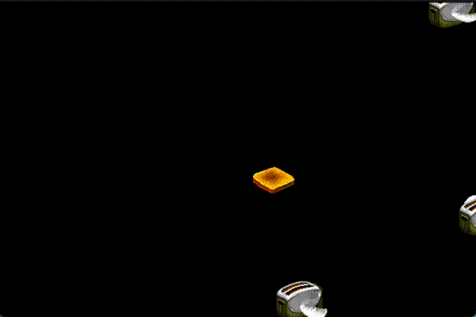

# Flying Toasters — macOS Screen Saver

An original pixel-art, flying-toaster-style screen saver for macOS.

## Requirements
- macOS with Xcode installed.
- The project uses Apple's ScreenSaver.framework.
- The target builds a `.saver` bundle.
- Standard architectures are enabled so Xcode can build for Apple Silicon and Intel as appropriate.

## Open and build
1. Open `FlyingToasters.xcodeproj` in Xcode.
2. Select the `FlyingToasters` target.
3. Under **Signing & Capabilities**, choose your Development Team if Xcode asks for signing.
4. Choose **Product > Build**.
5. Choose **Product > Show Build Folder in Finder**.
6. Locate `FlyingToasters.saver` under the appropriate Products/Debug folder.

## Install
Double-click `FlyingToasters.saver`, or copy it to:

    ~/Library/Screen Savers/

Then open:

    System Settings > Screen Saver

and select **Flying Toasters**.

## Configuration
The screen saver exposes:
- Toaster density
- Flight speed
- Flying toast on/off

Settings use `ScreenSaverDefaults`.

## Bundle identifier
The starter project uses:

    com.example.FlyingToasters

Change this in both:
- `FlyingToasters/Info.plist`
- `moduleIdentifier` in `FlyingToastersView.swift`

Keep the two values identical.

## Artwork
The PNG sprites in `FlyingToasters/Assets` are original pixel artwork generated.

Original After Dark 2.0 Flying Toasters! © 1990 Berkeley Systems Inc. by Jack Eastman, Bruce Burkhalter, and Patrick Beard. Artwork by Tomoya Ikeda.

📚 References

After Dark Wikipedia:
[https://docwiki.embarcadero.com/InterBase/2020/en/Main_Page](https://en.wikipedia.org/wiki/After_Dark_(software))

##  License

## MIT License

Copyright (c) 2026 David Scott Bird/Mark Teicher, TruSecure, LLC
